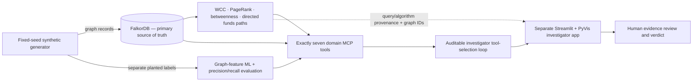

# Ringtrace — Financial Crime Investigation Workspace

A frontend-only investigation dashboard for a synthetic fraud-ring detection demo. It brings graph relationships, suspicious transfer paths, explainable risk factors, evidence and analyst activity into one case workspace.

## Run locally

```bash
npm ci
npm run dev
```

The Vite development server binds to `0.0.0.0` for preview environments. To create and inspect a production build:

```bash
npm run build
npm run preview
```

## Demo interactions

- Search accounts, people, devices, IP addresses, transactions and investigations from the top bar (`Ctrl/⌘ K`).
- Open **Graph explorer** to filter entity types, select connected nodes, zoom, pan or reset the relationship graph.
- Use **Trace path** to highlight the three-hop transfer sequence and inspect individual transaction records.
- Acknowledge or resolve alerts, inspect evidence detail, create a local investigation and export the report or transaction ledger.
- Navigation, filters and session actions are client-side only.

All people, accounts, amounts, identifiers and event history are fictional. The score is presented as an explainable sum of mock graph-derived signals and is not a real-world finding. No backend, live financial data or model inference is connected.

## Graph Hacks 2026 — Track 01 preparation

**Status checked 2 October 2026:** this repository is still the React/Vite mock-data prototype described above. The FalkorDB graph pipeline, synthetic generator/ground truth, graph analytics, seven MCP tools, ML evaluation and Streamlit app have **not** been implemented before the event. The core FalkorDB implementation is intentionally deferred until hacking opens. See [`COMPARISON.md`](COMPARISON.md) for the code/reference review and license notes.

The official schedule lists hacking from **15 October 2026, 12:01 AM IST** through the **18 October 2026, 11:59 PM IST** submission deadline ([schedule](https://www.wemakedevs.org/hackathons/falkordb/schedule)).

### Planned event-period architecture



This is a **plan**, not a claim that these services or connections currently exist. The target launch command is `docker compose up --build`, after the event-period Compose stack is implemented and verified; it does not work in the current checkout.

### Track feature-to-evidence map

| Track 01 feature | Planned output | Current status |
|---|---|---|
| Deterministic synthetic data with planted ground truth | Fixed-seed graph records plus a separate label/expected-result artifact. | Not implemented; current UI uses hand-authored mock data. |
| FalkorDB ingestion and graph schema | FalkorDB as the required primary database, with Person, Account, Device and IP nodes and evidence-bearing relationships. | Not implemented; no FalkorDB connection or Compose file. |
| Graph analytics | WCC rings, PageRank leaders, broker/intermediary scoring, sinks and directed money-path tracing. | Not implemented; the graph renders hand-authored mock data and does not compute WCC or PageRank. |
| Exactly seven MCP tools | `find_sinks`, `detect_rings`, `rank_leaders`, `find_brokers`, `trace_funds`, `link_identities`, `score_risk`. | 0/7 implemented. Tools must be validated, read-only and evidence-returning. |
| Graph-derived ML evaluation | Report precision, recall, confusion counts, split and threshold without leaking planted labels. | Not implemented; no model or metric results exist yet. |
| Investigator dashboard and verdict | Add a separate Streamlit + PyVis app for seeded graph evidence and human review; retain this React/Vite prototype. | Existing React flows are prototype-only and not backed by FalkorDB. |
| Provenance, testing and reproducible run | Every claim resolves to graph IDs plus Cypher/algorithm provenance; one-command Compose path and seven individual tool smoke tests. | Not implemented; the frontend production build passes and Vite routes have returned HTTP 200. |

The default plan uses no paid LLM/API. Any provider that may incur cost requires owner approval first. The existing [`docs/research-summary.md`](docs/research-summary.md) records the earlier UI-only pass; this event plan extends that scope without replacing the prototype.

### Current prototype commands

```bash
npm ci
npm run dev
```

For the verified build check, run `npm run build`. Event-period setup and the commands that are not yet runnable are tracked in [`RUNBOOK.md`](RUNBOOK.md); tested commands and future metric outputs belong in [`RUN-LOG.md`](RUN-LOG.md). See [`TODO-BEFORE-SUBMISSION.md`](TODO-BEFORE-SUBMISSION.md) for the event checklist.
